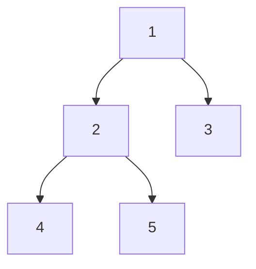

# 樹的 DFS、BFS 與遞迴

[回學習索引](../readme.md) · [測試方法](../testing.md)

DFS 沿著分支向下，BFS 一層一層走。遞迴是實作 DFS 的方式之一，明確的 stack 也能保存尚未完成的工作。

| 走訪方式 | 上圖的結果 | 處理時機 |
| --- | --- | --- |
| 前序 | 1, 2, 4, 5, 3 | 先處理自己 |
| 中序 | 4, 2, 5, 1, 3 | 左子樹之後處理自己 |
| 後序 | 4, 5, 2, 3, 1 | 子樹之後處理自己 |
| BFS | 1, 2, 3, 4, 5 | 同層處理完再往下 |

前序 stack 要先放右子節點，再放左子節點，左邊才會先被 pop。#145 和 #590 則先收集反向的走訪順序，最後反轉 result；不是在迴圈中等所有子節點完成才輸出根。

寫遞迴時先回答三件事：空節點回傳什麼、目前節點如何改變狀態、子樹結果如何合併。#112 傳遞剩餘總和；#404 傳遞是否來自左邊；#559 合併孩子的最大深度。

路徑題的終點必須是葉節點。#112 即使在中途已湊到 target，也不能直接回傳 True。

## 題目筆記

以下「現有測試」描述目前測試；「練習與邊界」是閱讀提醒或後續可補項目。n 表示元素數、h 表示樹高、w 表示最大層寬；其他符號在各題說明。

## 094 · Binary Tree Inorder Traversal

[解法](../../src/tree/lc_094_binary_tree_inorder_traversal.py) · [測試](../../tests/tree/test_lc_094_binary_tree_inorder_traversal.py) · Group：`tree`

回傳二元樹中序。一路壓入左節點，彈出時記錄，再轉到右子樹。

- **成本：** O(n) 時間，O(h) stack，輸出 O(n)。
- **現有測試：** 參數化樹形案例，比較完整走訪順序。
- **練習與邊界：** 一般二元樹中序不一定有序，只有 BST 才保證。

## 112 · Path Sum

[解法](../../src/tree/lc_112_path_sum.py) · [測試](../../tests/tree/test_lc_112_path_sum.py) · Group：`tree`

是否存在根到葉的路徑和等於 target。每往下扣掉目前值，只在葉節點檢查剩餘是否歸零。

- **成本：** O(n) 時間、O(h) 遞迴空間。
- **現有測試：** 參數化樹與目標總和。
- **練習與邊界：** 負數存在時不能因剩餘小於零而剪枝。

## 144 · Binary Tree Preorder Traversal

[解法](../../src/tree/lc_144_binary_tree_preorder_traversal.py) · [測試](../../tests/tree/test_lc_144_binary_tree_preorder_traversal.py) · Group：`tree`

回傳前序。pop 後先記錄節點，再把右、左孩子依序壓入 stack。

- **成本：** O(n) 時間，O(h) stack，輸出 O(n)。
- **現有測試：** 參數化案例，使用樹 helper。
- **練習與邊界：** 左右都存在時才能有效抓到壓入順序錯誤。

## 145 · Binary Tree Postorder Traversal

[解法](../../src/tree/lc_145_binary_tree_postorder_traversal.py) · [測試](../../tests/tree/test_lc_145_binary_tree_postorder_traversal.py) · Group：`tree`

回傳後序。先收集中、右、左，再反轉成左、右、中。

- **成本：** O(n) 時間、O(n) 空間，包含結果及反轉副本。
- **現有測試：** 參數化案例檢查完整順序。
- **練習與邊界：** 不要誤寫成前序結果直接反轉。

## 222 · Count Complete Tree Nodes

[解法](../../src/tree/lc_222_count_complete_tree_nodes.py) · [測試](../../tests/tree/test_lc_222_count_complete_tree_nodes.py) · Group：`tree`

計算完全二元樹節點數。左右最外側高度相同時，用 2^h−1；否則遞迴兩側。

- **成本：** 完全二元樹下 O(log² n) 時間、O(log n) 空間。
- **現有測試：** 參數化完全二元樹案例。
- **練習與邊界：** 公式依賴完全二元樹前提，不能套用任意樹。

## 257 · Binary Tree Paths

[解法](../../src/tree/lc_257_binary_tree_paths.py) · [測試](../../tests/tree/test_lc_257_binary_tree_paths.py) · Group：`tree`

列出根到葉的字串路徑。往下建立新的路徑字串，遇到葉節點才加入答案。

- **成本：** 以字串長度計，O(nh) 時間上界；含輸出最壞 O(nh) 空間。
- **現有測試：** 參數化案例，排序後比較路徑。
- **練習與邊界：** 不可只比較路徑數；鏈狀樹也有字串複製成本。

## 404 · Sum Of Left Leaves

[解法](../../src/tree/lc_404_sum_of_left_leaves.py) · [測試](../../tests/tree/test_lc_404_sum_of_left_leaves.py) · Group：`tree`

加總左葉節點。DFS 帶入 is_left，只有既是左孩子又沒有孩子的節點才計入。

- **成本：** O(n) 時間、O(h) 空間。
- **現有測試：** 參數化樹形案例。
- **練習與邊界：** 根節點本身不算左葉，左側內部節點也不算。

## 559 · Maximum Depth Of N Ary Tree

[解法](../../src/tree/lc_559_maximum_depth_of_n_ary_tree.py) · [測試](../../tests/tree/test_lc_559_maximum_depth_of_n_ary_tree.py) · Group：`tree`

求 N 元樹最大深度。目前提供 stack DFS、遞迴 DFS、逐層 BFS 三種解法，空樹為 0。

- **成本：** 三者時間 O(n)；stack 最壞 O(n)，目前遞迴含暫存列表最壞 O(n)，BFS O(w)。
- **現有測試：** 固定深鏈與寬樹，加上生成樹與參考遞迴比對三種解法。
- **練習與邊界：** 目前 DFS/BFS 迴圈需要 children 可迭代；helper 用空 list 表示葉節點。

## 589 · N Ary Tree Preorder Traversal

[解法](../../src/tree/lc_589_n_ary_tree_preorder_traversal.py) · [測試](../../tests/tree/test_lc_589_n_ary_tree_preorder_traversal.py) · Group：`tree`

回傳 N 元樹前序。先記錄自己，再把 children 反向壓入，保持由左至右。

- **成本：** O(n) 時間、O(n) 空間。
- **現有測試：** 參數化案例與 Hypothesis 參考解法比對。
- **練習與邊界：** 一個根有多個孩子時最能看出順序。

## 590 · N Ary Tree Postorder Traversal

[解法](../../src/tree/lc_590_n_ary_tree_postorder_traversal.py) · [測試](../../tests/tree/test_lc_590_n_ary_tree_postorder_traversal.py) · Group：`tree`

回傳 N 元樹後序。children 正向入 stack，取得反向順序後反轉整個結果。

- **成本：** O(n) 時間、O(n) 空間。
- **現有測試：** 參數化案例與生成樹，對照遞迴後序。
- **練習與邊界：** 生成器只把新節點接到舊節點，避免生成環。
