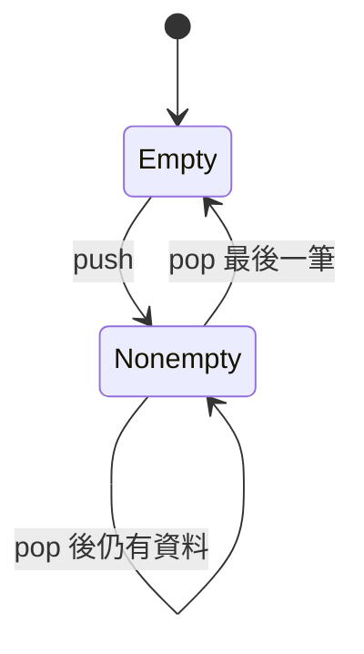

# 如何測試解法

[回學習索引](readme.md)

先確認題目要求的輸出，再選比較方式。純函式通常比較回傳值；原地修改題需要檢查輸入容器；鏈結串列交集需要確認回傳的是同一個節點。

## 固定案例與參數化

多數題目使用固定案例。`pytest.mark.parametrize` 讓同一個測試函式套用多組輸入與預期結果；`pytest.param(..., id="empty-tree")` 則讓失敗訊息更容易辨認。

挑案例時，讓每組資料驗證不同理由：空樹驗證遞迴出口，只有根節點驗證葉節點，左右不對稱的樹驗證走訪順序。單純換一批數字通常不會增加太多檢查能力。

## 原地修改：檢查有效內容

#26、#27 原先只檢查回傳長度，現在也檢查修改後的前綴。否則即使程式回傳正確的 k，卻完全沒有寫入資料，測試仍可能通過。

```python
from src.array.lc_026_remove_duplicates_from_sorted_array import Solution

nums = [1, 1, 2]
k = Solution().removeDuplicates(nums)
assert k == 2
assert nums[:k] == [1, 2]
```

#88 要在呼叫後檢查 nums1。現有實作額外回傳 nums1，舊測試保留這個行為；新增案例驗證題目要求的原地修改。

## 節點值與節點身分

#160 的 helper 讓兩條串列共用同一段尾端。測試使用 `actual is intersect_node`，不能只用 val 相等。#141 也需要把尾端真正接回前面的節點；值重複的線性串列不是環。

串列一般可轉回 list 比較，但有環的串列不能使用一直走到 None 的轉換器，否則會無限迴圈。

## 輸出可能不唯一

#257 的路徑和 #501 的眾數沒有指定順序，因此測試排序後比較。#94 等走訪題則必須比較原順序。

#108 目前固定比較層序樹形，對目前的中點策略有效。若引入另一個合法解法，建議改用「中序等於原陣列」和「每個節點兩側高度差不超過 1」，避免誤判其他合法形狀。

## Hypothesis：生成資料，再驗證性質

現有 #589、#590 生成 N 元樹，將迭代結果與測試內的遞迴參考解法比較。#559 則將三種最大深度實作與參考解法比較。這種做法也稱 differential testing：用不同實作交叉驗證同一份輸入。

生成器將第 i 個節點接到索引小於 i 的父節點，既保持連通，也避免產生環。這樣生成的資料才符合樹的前提。#590 節點值使用索引；#559 另外生成整數值，因此兩者的資料範圍不完全相同。

`@given` 提供輸入，`@st.composite` 允許依先前產生的大小建立資料。發現失敗時，Hypothesis 會嘗試縮小案例，幫助定位錯誤；不保證找到數學上最小的反例。

參考解法也可能有錯，且若與正式解法太相似，可能共享同一個錯誤。因此仍保留人工可驗算的固定案例。

## 狀態機：測試操作之間的關係

#225 和 #232 已使用 `RuleBasedStateMachine`。除了生成數值，也生成不同順序的 push、pop、top/peek、empty，並與 Python list 模型同步比較。



`@rule` 宣告可執行操作；`@precondition` 讓 pop、peek、top 只在模型非空時執行。這符合目前測試採用的合法操作範圍。empty 在現有程式是可被選中的 rule，並非每一步都會自動執行的 invariant。

只測「先全部 push，再全部 pop」較難抓到 #232 的搬移時機錯誤。交錯操作才能檢查 output 尚有資料時，新加入的 input 是否仍排在後方。

## 執行方式

在專案根目錄執行：

```bash
poetry run pytest -q
poetry run pytest tests/queue/test_lc_232_implement_queue_using_stacks.py -q
poetry run pytest tests/tree/test_lc_559_maximum_depth_of_n_ary_tree.py -q
```

一般案例、生成資料、狀態機都由 pytest 收集。這些測試沒有量測執行效能；複雜度分析也不能由通過測試或執行秒數推導。
